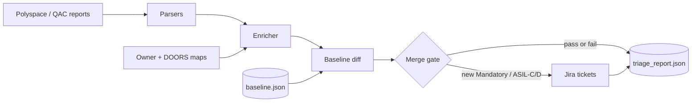
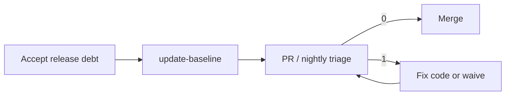

# Automated Static Analysis & MISRA Triage Dashboard

Post-build CLI for **Polyspace Bug Finder** / **Helix QAC** that turns noisy static-analysis drops into a **baseline-aware merge gate** and **owner-mapped Jira tickets**.

| Capability | Behavior |
|------------|----------|
| Parse | SARIF + Polyspace/QAC XML → normalized `Violation` model |
| Diff | New vs accepted technical debt (fingerprint baseline) |
| Gate | Fail CI on **new** MISRA C:2012 **Mandatory** or **ASIL-C/D** |
| Ticket | Grouped Jira issues → SWC owner + DOORS requirement ID |

## Documentation

| Guide | Description |
|-------|-------------|
| [docs/README.md](docs/README.md) | Documentation index |
| [Architecture](docs/ARCHITECTURE.md) | System design + Mermaid diagrams |
| [User Guide](docs/USER_GUIDE.md) | CLI workflows, exit codes, CI |
| [Configuration](docs/CONFIGURATION.md) | YAML & secrets reference |
| [Development](docs/DEVELOPMENT.md) | Setup, tests, extension points |

Folder READMEs: [`config/`](config/README.md) · [`samples/`](samples/README.md) · [`tests/`](tests/README.md)

## Architecture at a glance



End-to-end design, class model, and reliability path: **[docs/ARCHITECTURE.md](docs/ARCHITECTURE.md)**.

### Package map

```text
src/misra_triage/
├── cli.py                 # Click entrypoint (CI exit codes)
├── service.py             # Orchestration facade
├── models/                # Violation, Config, TriageReport
├── parsers/               # Strategy: SARIF / Polyspace XML / QAC XML
├── baseline/              # Fingerprint store + differ
├── gate/                  # Merge policy
├── mapping/               # Path → SWC / owner / DOORS / ASIL
├── jira/                  # Ticket factory + REST client
└── utils/                 # Logging + retry helpers
```

| Concern | Approach |
|--------|----------|
| Format variance | Strategy pattern (`ReportParser`) + auto-detect |
| Identity across drops | SHA-256 fingerprint (rule + path/line/col/message) |
| Merge safety | Gate evaluates *new* findings only |
| Ownership | Longest-prefix YAML maps |
| Jira noise | Group by `(SWC, owner, DOORS, category)` |
| Reliability | Row isolation, atomic baseline I/O, retry on 5xx |

## Quick start

```bash
python3 -m venv .venv
source .venv/bin/activate
pip install -e ".[dev]"

# 1) Seed baseline from the current release drop (accepted debt)
misra-triage update-baseline \
  --config config/default.yaml \
  --report-dir samples/

# 2) Triage a new drop (exit 1 if blocking new violations)
misra-triage triage \
  --config config/default.yaml \
  --report-dir samples/
```

Or: `make install && make baseline && make triage`

### Exit codes

| Code | Meaning |
|------|---------|
| `0` | Gate passed |
| `1` | Gate failed (new Mandatory / ASIL-C/D) |
| `2` | Tool / config / parse failure |

## Typical workflow



1. **Release N baseline** — `update-baseline` after accepting known debt  
2. **PR / nightly** — `triage` diffs against baseline  
3. **Gate** — CI fails on new Mandatory or ASIL-C/D  
4. **Tickets** — one Jira issue per SWC/owner/DOORS/category (dry-run by default)  
5. **Fix or waive** — fix code, or refresh baseline after review  

Full walkthrough: [User Guide](docs/USER_GUIDE.md).

## CI integration

```yaml
- name: MISRA triage gate
  run: |
    misra-triage triage \
      --config config/default.yaml \
      --report-dir ${{ env.STATIC_ANALYSIS_OUT }} \
      --json-out > triage.json
```

Artifact: `reports/triage_report.json` (dashboard-ready).

## Configuration

- [`config/default.yaml`](config/default.yaml) — gate + Jira + paths  
- [`config/owner_map.yaml`](config/owner_map.yaml) — SWC / owner / ASIL  
- [`config/doors_map.yaml`](config/doors_map.yaml) — DOORS requirement IDs  

```bash
export JIRA_USER_EMAIL="bot@example.com"
export JIRA_API_TOKEN="***"
```

Keep `jira.dry_run: true` until a sandbox project is validated. Details: [Configuration](docs/CONFIGURATION.md).

## Testing

```bash
make test
# pytest --cov=misra_triage --cov-report=term-missing
```

| Level | Location |
|-------|----------|
| Unit | `tests/unit/` |
| Integration | `tests/integration/` |
| Edge cases | `tests/edge/` |

See [Development](docs/DEVELOPMENT.md) and [`tests/README.md`](tests/README.md).

## License

MIT (see `pyproject.toml`).
