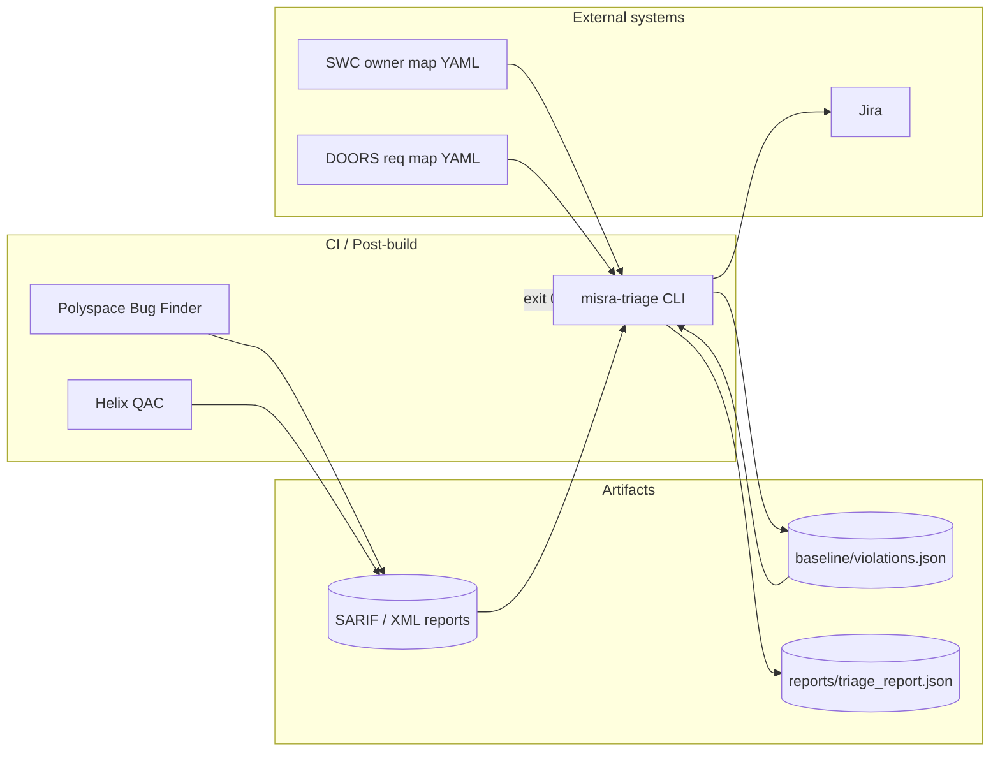
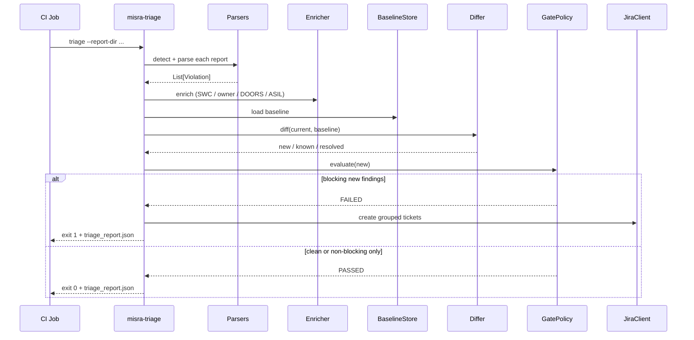
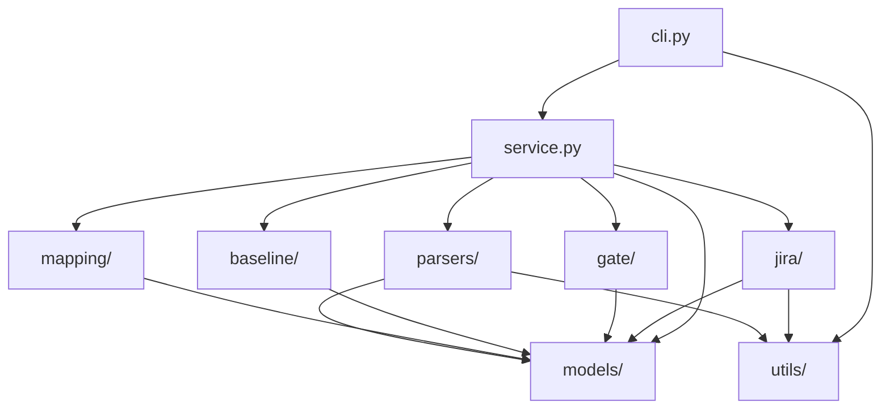
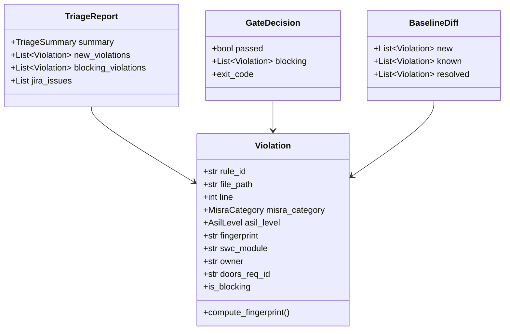
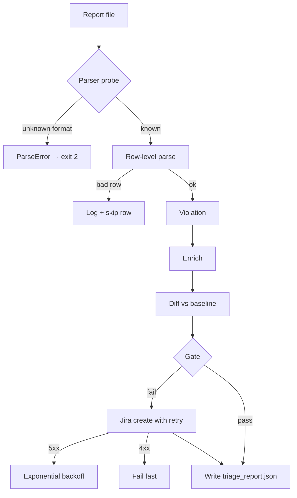

# Architecture

## 1. Problem statement

Automotive static analysis (Polyspace Bug Finder / Helix QAC) produces thousands of findings per release drop. Manual triage of **new** vs **legacy** MISRA violations burns engineering time and lets Mandatory / ASIL-critical regressions slip into merges.

`misra-triage` is a **post-build CLI** that:

1. Normalizes multi-tool reports into a single domain model
2. Diffs against an accepted **baseline** of technical debt
3. **Blocks CI** when new Mandatory or ASIL-C/D findings appear
4. Opens **categorized Jira tickets** mapped to SWC owners and DOORS IDs

## 2. Context (C4 container view)



## 3. Pipeline (runtime sequence)



## 4. Component package map



| Package | Responsibility | Key types |
|---------|----------------|-----------|
| `models/` | Domain + config (Pydantic) | `Violation`, `AppConfig`, `TriageReport` |
| `parsers/` | Tool-format adapters (Strategy) | `ReportParser`, `SarifParser`, `PolyspaceXmlParser`, `QacXmlParser` |
| `baseline/` | Persist & diff technical debt | `BaselineStore`, `BaselineDiff` |
| `gate/` | Merge policy | `GatePolicy`, `GateDecision` |
| `mapping/` | Path → ownership / ASIL / DOORS | `ViolationEnricher` |
| `jira/` | Ticket grouping + REST | `TicketFactory`, `JiraClient` |
| `service.py` | Application service / facade | `TriageService` |
| `cli.py` | Presentation / CI interface | Click commands |

## 5. Domain model



### Fingerprint identity

A finding’s stable ID is:

```text
sha256( rule_id | normalized_path | line | column | normalized_message )
```

Paths are lowercased and slash-normalized; messages are whitespace-collapsed. This keeps baseline comparison deterministic across tool exporters.

## 6. Design patterns & SOLID

| Pattern / principle | Where | Why |
|---------------------|-------|-----|
| **Strategy** | `ReportParser` implementations | Swap SARIF/XML without changing orchestration |
| **Facade** | `TriageService` | Single entry for parse → enrich → diff → gate → Jira |
| **Factory** | `TicketFactory` | Build categorized Jira payloads from violation groups |
| **Policy** | `GatePolicy` | Keep merge rules declarative and testable |
| **SRP** | Package boundaries | Parsing ≠ gating ≠ ticketing |
| **OCP** | New parsers / policy flags | Extend via new classes or YAML, not rewrites |
| **DIP** | Service depends on abstractions | Parsers selected via `detect_parser()` |

## 7. Reliability mechanisms



- **Per-row isolation** — one corrupt SARIF/XML node does not abort the whole report
- **Atomic baseline writes** — `.tmp` + rename
- **Retryable Jira errors only** — HTTP 5xx / transport; 4xx not retried
- **Dry-run default** — no tickets against production until explicitly enabled
- **Strict parse mode** — `gate.fail_on_parse_errors` fails the job when a file cannot be read

## 8. Merge-gate policy

Default policy blocks a merge when **any new** finding has:

- `misra_category == mandatory`, **or**
- `asil_level ∈ {C, D}`

Baseline (known) debt is never blocking. Advisory / Required findings at ASIL A/B do not fail the gate unless you change `config/default.yaml`.

## 9. Jira categorization

New violations are grouped by:

```text
(swc_module, owner, doors_req_id, misra_category)
```

Each group becomes one issue so SWC owners receive a single triage ticket per drop instead of one ticket per finding.

## 10. Extension points

| Need | Extension |
|------|-----------|
| New report format | Implement `ReportParser`, register in `detect_parser()` |
| Custom mandatory rules | Extend `parsers/rule_catalog.py` or enrich from tool properties |
| Different gate rules | Edit `gate.block_misra_categories` / `block_asil_levels` |
| Alt ticketing (Azure DevOps, etc.) | Add a client parallel to `jira/` and call from `TriageService` |
| Dashboard UI | Consume `reports/triage_report.json` (already dashboard-shaped) |

## 11. Repository layout

```text
.
├── README.md                 # Project entry
├── docs/                     # Architecture & guides
├── config/                   # Runtime YAML
├── samples/                  # Example tool exports
├── src/misra_triage/         # Application package
├── tests/                    # unit / integration / edge
├── baseline/                 # Accepted debt store (generated/committed per project)
├── reports/                  # Triage JSON artifact (CI)
└── .github/workflows/ci.yml  # Multi-Python CI
```
