# Architecture

Detailed system design for **`misra-triage`**: a post-build CLI that turns Polyspace / QAC static-analysis noise into a baseline-aware merge gate and owner-mapped Jira tickets.

Related docs: [User Guide](USER_GUIDE.md) · [Configuration](CONFIGURATION.md) · [Development](DEVELOPMENT.md) · [Operations](OPERATIONS.md) · [ADRs](ADR.md)

---

## 1. Problem statement

Automotive static analysis (Polyspace Bug Finder / Helix QAC) produces thousands of findings per release drop. Manual triage of **new** vs **legacy** MISRA violations burns engineering time and lets Mandatory / ASIL-critical regressions slip into merges.

`misra-triage` solves this by:

1. Normalizing multi-tool reports into a single domain model  
2. Diffing against an accepted **baseline** of technical debt  
3. **Blocking CI** when new Mandatory or ASIL-C/D findings appear  
4. Opening **categorized Jira tickets** mapped to SWC owners and DOORS IDs  

### Goals / non-goals

| Goals | Non-goals |
|-------|-----------|
| Deterministic new-vs-legacy classification | Replacing Polyspace/QAC themselves |
| Fail-closed merge gate for safety-critical new debt | Interactive GUI (JSON is the dashboard contract) |
| Stable fingerprints across tool exporters | Perfect MISRA catalog completeness out of the box |
| Low-noise Jira (grouped by SWC/DOORS) | Full ALM/DOORS live API sync (YAML maps first) |

---

## 2. C4 — System context

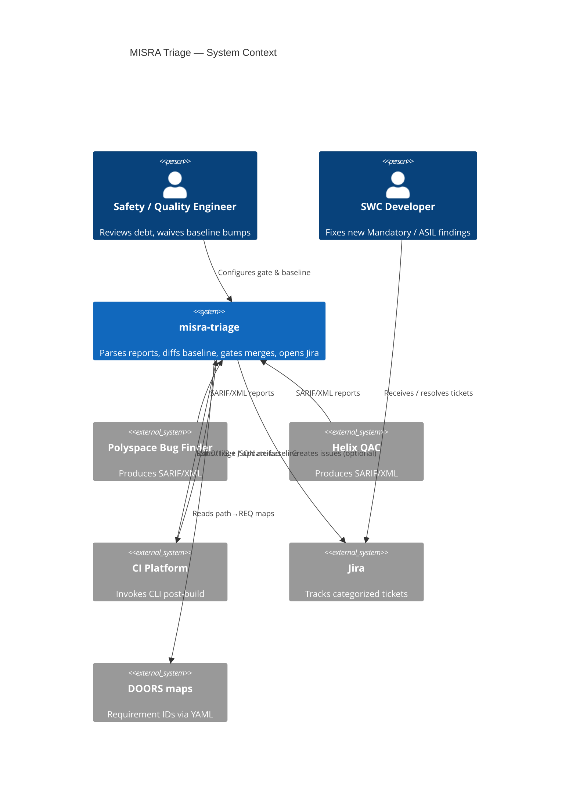

If your Markdown renderer does not support C4, use the equivalent flowchart below.

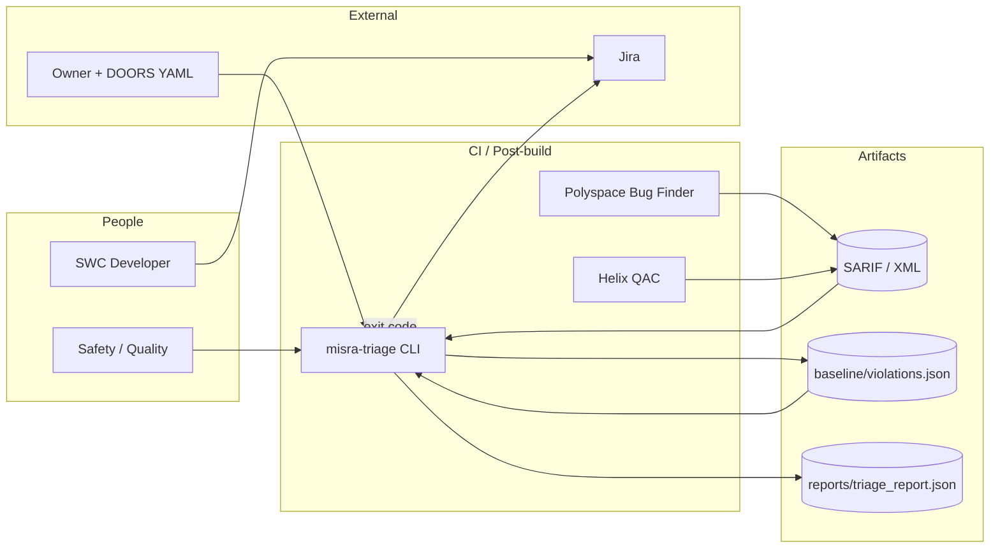

---

## 3. C4 — Containers

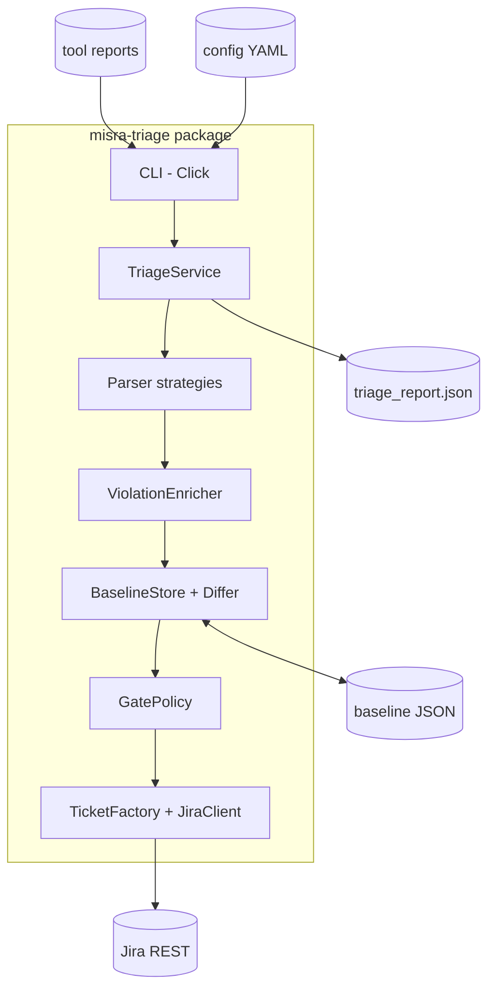

---

## 4. Runtime pipeline (sequence)

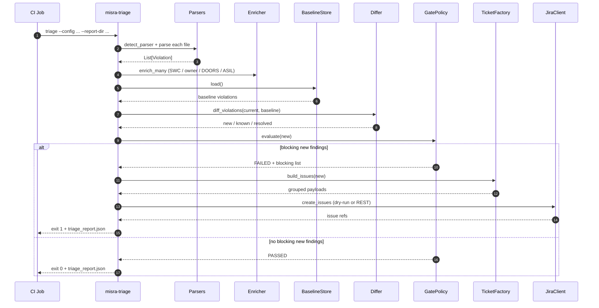

### Stage summary

| Stage | Input | Output | Failure mode |
|-------|-------|--------|--------------|
| Parse | Report paths | `Violation[]` | Unknown format → exit `2` (if strict) |
| Enrich | Violations + maps | Annotated violations | Missing map → `unassigned` / `UNKNOWN` |
| Diff | Current + baseline | new / known / resolved | Corrupt baseline → exit `2` |
| Gate | New violations | `GateDecision` | Blocking → exit `1` |
| Jira | New violations | Issue refs | 5xx retried; 4xx fail fast |
| Report | Full result | `triage_report.json` | Disk I/O error → exit `2` |

---

## 5. Component package map

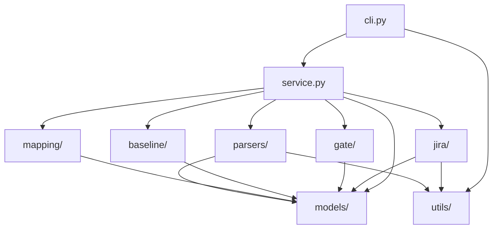

| Package | Responsibility | Key types | README |
|---------|----------------|-----------|--------|
| `models/` | Domain + config (Pydantic) | `Violation`, `AppConfig`, `TriageReport` | [src/.../models/README](../src/misra_triage/models/README.md) |
| `parsers/` | Tool-format adapters (Strategy) | `ReportParser`, SARIF/XML parsers | [parsers/README](../src/misra_triage/parsers/README.md) |
| `baseline/` | Persist & diff technical debt | `BaselineStore`, `BaselineDiff` | [baseline/README](../src/misra_triage/baseline/README.md) |
| `gate/` | Merge policy | `GatePolicy`, `GateDecision` | [gate/README](../src/misra_triage/gate/README.md) |
| `mapping/` | Path → ownership / ASIL / DOORS | `ViolationEnricher` | [mapping/README](../src/misra_triage/mapping/README.md) |
| `jira/` | Ticket grouping + REST | `TicketFactory`, `JiraClient` | [jira/README](../src/misra_triage/jira/README.md) |
| `service.py` | Application facade | `TriageService` | — |
| `cli.py` | CI presentation | Click commands | — |

---

## 6. Domain model

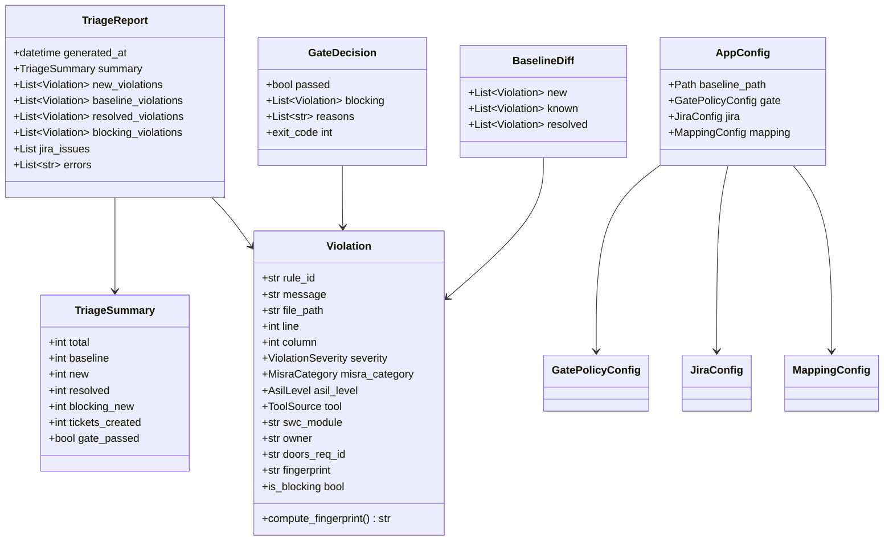

### Fingerprint identity

```text
sha256( lower(rule_id) | normalize(path) | line | column | normalize(message) )
```

- Paths: `\` → `/`, strip `./`, lowercase  
- Messages: collapse whitespace, lowercase  
- Same logical finding ⇒ same fingerprint across drops  

### Diff set semantics

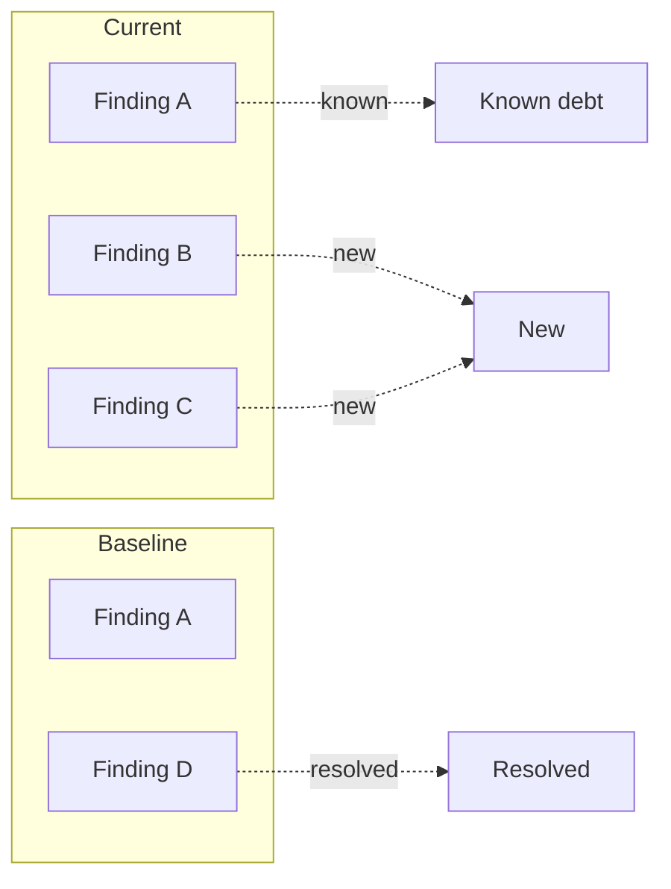

---

## 7. Parser strategy

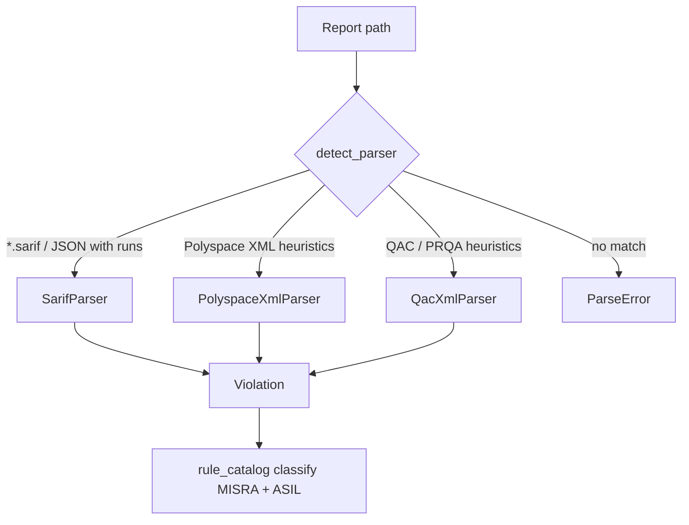

Probe order matters: SARIF first, then Polyspace XML, then QAC XML. Filename hints (`*qac*`, `*polyspace*`) break ties for ambiguous XML.

---

## 8. Merge-gate state machine

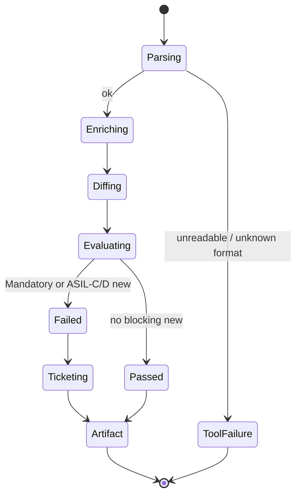

Default block condition (new findings only):

```text
misra_category ∈ block_misra_categories  OR  asil_level ∈ block_asil_levels
```

Defaults: `mandatory` and `{C, D}`. Baseline debt never transitions to `Failed`.

---

## 9. Jira categorization

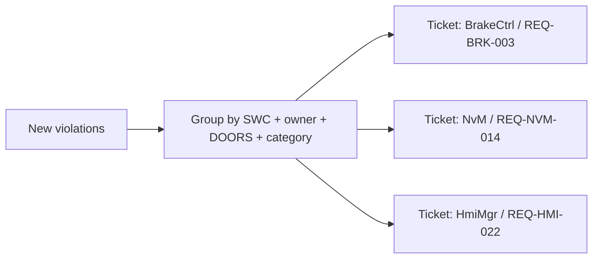

Grouping key:

```text
(swc_module, owner, doors_req_id, misra_category)
```

Dry-run emits `DRY-n` keys without calling Jira REST.

---

## 10. Design patterns & SOLID

| Pattern / principle | Where | Why |
|---------------------|-------|-----|
| **Strategy** | `ReportParser` | Swap SARIF/XML without changing orchestration |
| **Facade** | `TriageService` | One entry for the pipeline |
| **Factory** | `TicketFactory` | Build categorized Jira payloads |
| **Policy** | `GatePolicy` | Declarative, testable merge rules |
| **SRP** | Package boundaries | Parsing ≠ gating ≠ ticketing |
| **OCP** | New parsers / YAML flags | Extend without rewriting the core |
| **DIP** | `detect_parser()` | Service depends on abstraction |

---

## 11. Reliability & error handling

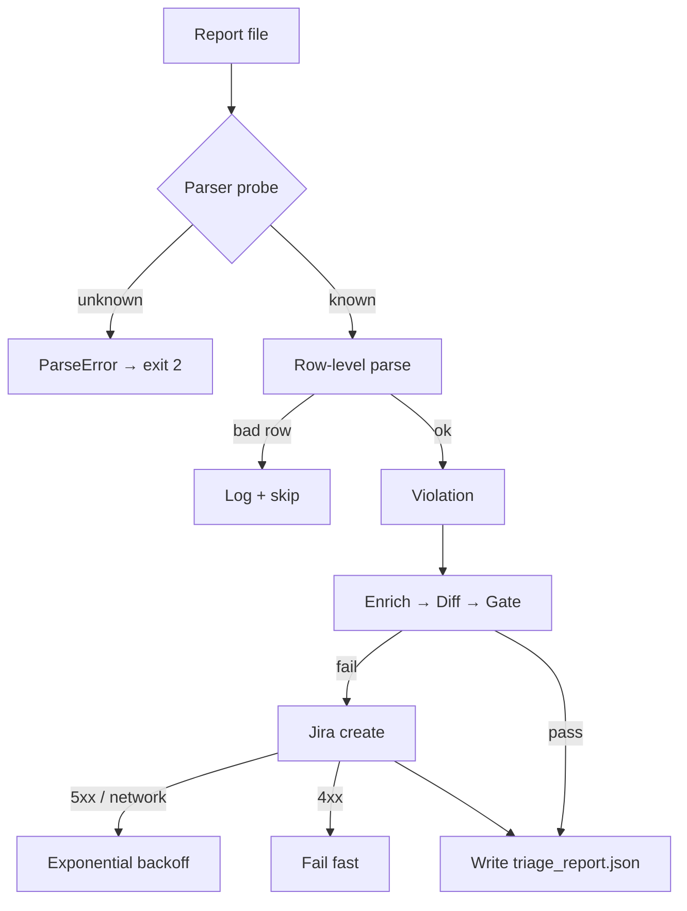

| Mechanism | Detail |
|-----------|--------|
| Per-row isolation | Corrupt SARIF/XML node ≠ abort whole file |
| Atomic baseline | Write `.tmp` then `replace()` |
| Selective retry | `JiraRetryableError` for 5xx only |
| Dry-run default | No production tickets until configured |
| Strict parse | `fail_on_parse_errors` fails the job on bad inputs |

---

## 12. Deployment / CI topology

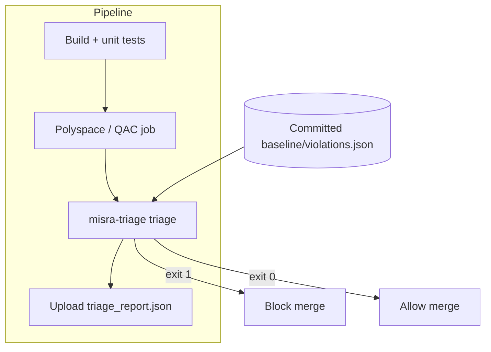

Recommended: run triage **after** static analysis artifacts are published; commit baseline updates only via reviewed PRs.

---

## 13. Extension points

| Need | How |
|------|-----|
| New report format | Implement `ReportParser`, register in `detect_parser()` |
| Custom mandatory rules | Extend `rule_catalog.py` or tool properties |
| Different gate rules | Edit `gate.block_*` in YAML |
| Alt ticketing | Parallel client to `jira/`, wire in `TriageService` |
| Dashboard UI | Consume `reports/triage_report.json` |

---

## 14. Repository layout

```text
.
├── README.md
├── docs/                      # Architecture, guides, ADRs, ops
├── config/                    # Runtime YAML + README
├── samples/                   # Example tool exports + README
├── src/misra_triage/          # Application (+ per-package READMEs)
├── tests/                     # unit / integration / edge + README
├── baseline/                  # Accepted debt store + README
└── .github/workflows/ci.yml
```
