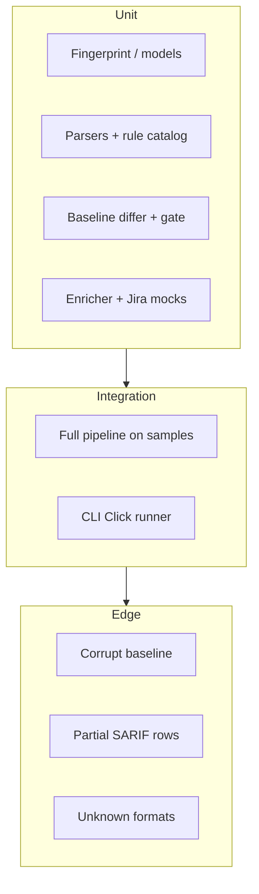

# Development Guide

Contributor guide for extending and testing `misra-triage`.

Also see: [Architecture](ARCHITECTURE.md) · [ADRs](ADR.md) · [package READMEs](../src/misra_triage/README.md)

## Setup

```bash
make install
make test
```

Requires Python 3.9+. On 3.9, `eval-type-backport` is pulled in automatically for Pydantic union syntax.

## Project layout (code)

```text
src/misra_triage/
├── cli.py              # Click commands
├── service.py          # TriageService orchestration
├── models/             # Pydantic models
├── parsers/            # ReportParser strategies
├── baseline/           # Store + differ
├── gate/               # Merge policy
├── mapping/            # Enricher
├── jira/               # TicketFactory + JiraClient
└── utils/              # logging, retry helper
```

See [ARCHITECTURE.md](ARCHITECTURE.md) for diagrams and design rationale.

## Testing strategy



| Suite | Path | Focus |
|-------|------|-------|
| Unit | `tests/unit/` | Pure logic, parsers, policy, mocks |
| Integration | `tests/integration/` | End-to-end `TriageService` + CLI |
| Edge | `tests/edge/` | Resilience / malformed inputs |

Run:

```bash
pytest --cov=misra_triage --cov-report=term-missing
# or
make test
```

Coverage gate: **80%** (`pyproject.toml`).

## Adding a parser

1. Implement `ReportParser` (`can_parse`, `parse`) under `parsers/`.
2. Register in `detect_parser()` (order matters — more specific probes first).
3. Add a fixture under `samples/` and unit tests under `tests/unit/test_parsers.py`.
4. Prefer returning normalized `Violation` objects; never leak tool-specific types past the parser boundary.

## Changing gate policy

Prefer YAML (`gate.block_*`) over code changes. If you need new dimensions (e.g. CERT severity), extend `Violation` + `GatePolicy.is_blocking` with tests in `tests/unit/test_baseline_and_gate.py`.

## Lint

```bash
make lint
# ruff check src tests
```

## CI

[`.github/workflows/ci.yml`](../.github/workflows/ci.yml) runs install → pytest → smoke `update-baseline` / `triage` on Python 3.9, 3.11, and 3.12.

## Design constraints (keep these)

- Baseline debt must never block merges
- Fingerprints must stay stable across path casing / message whitespace
- Jira dry-run remains the safe default
- No secrets in YAML or committed `.env`
