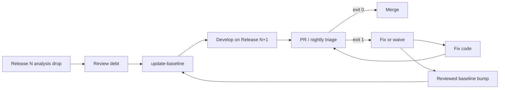

# User Guide

Practical guide to installing and running `misra-triage` in local and CI environments.

Also see: [Architecture](ARCHITECTURE.md) · [Configuration](CONFIGURATION.md) · [Operations](OPERATIONS.md) · [FAQ](FAQ.md)

## Prerequisites

- Python **3.9+**
- Polyspace Bug Finder and/or Helix QAC report exports (SARIF or XML)
- Optional: Jira Cloud/Server credentials for ticket creation

## Install

```bash
python3 -m venv .venv
source .venv/bin/activate          # Windows: .venv\Scripts\activate
pip install -e ".[dev]"
```

Or: `make install`

## Commands

### `update-baseline`

Accept the current report drop as known technical debt.

```bash
misra-triage update-baseline \
  --config config/default.yaml \
  --report-dir path/to/static-analysis-out \
  --note "Release 12.3 accepted debt"
```

Writes `baseline/violations.json` (path configurable).

### `triage`

Parse → enrich → diff → gate → optional Jira → JSON report.

```bash
misra-triage triage \
  --config config/default.yaml \
  --report-dir path/to/static-analysis-out
```

Options:

| Flag | Meaning |
|------|---------|
| `--report PATH` | Add a single report (repeatable) |
| `--report-dir DIR` | Glob `*.sarif`, `*.json`, `*.xml` |
| `--no-jira` | Skip ticket creation |
| `--json-out` | Print full report JSON to stdout |

### `validate-config`

```bash
misra-triage validate-config --config config/default.yaml
```

## Exit codes

| Code | When | CI action |
|------|------|-----------|
| `0` | Gate passed | Allow merge |
| `1` | New Mandatory or ASIL-C/D findings | Block merge |
| `2` | Config/parse/runtime failure | Fail job (tooling problem) |

## Recommended release workflow



1. After accepting debt for a release, run **`update-baseline`** once.
2. Every PR/nightly run **`triage`** against that baseline.
3. On gate failure: fix the new violation, or after safety-team waiver run `update-baseline` again.
4. Commit `baseline/violations.json` with the release so all CI agents share the same debt snapshot.

## CI example

```yaml
- name: MISRA triage gate
  env:
    JIRA_USER_EMAIL: ${{ secrets.JIRA_USER_EMAIL }}
    JIRA_API_TOKEN: ${{ secrets.JIRA_API_TOKEN }}
  run: |
    misra-triage triage \
      --config config/default.yaml \
      --report-dir "${STATIC_ANALYSIS_OUT}" \
      --json-out | tee triage.json
```

Upload `reports/triage_report.json` (and optionally `triage.json`) as a build artifact for dashboards.

## Reading the summary

| Metric | Meaning |
|--------|---------|
| Total findings | All parsed + enriched violations this drop |
| Baseline (known debt) | Still present and already accepted |
| New | Not in baseline — candidates for gate/Jira |
| Resolved since baseline | In baseline but gone now (good news) |
| Blocking new | Subset of new that fail the gate |
| Jira tickets | Issues created (or dry-run placeholders) |

## Sample dry run

```bash
make baseline
make triage
```

Uses files under [`samples/`](../samples/). Expect **gate PASSED** after baseline is seeded.
