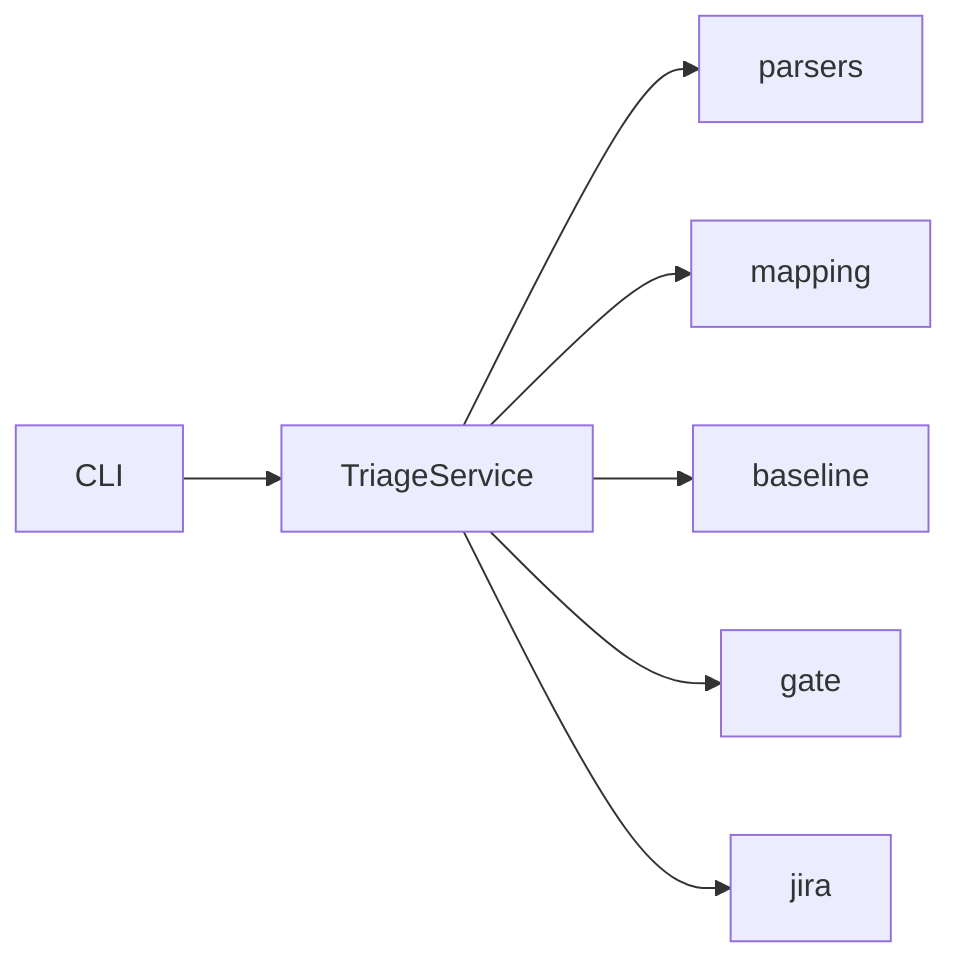

# `misra_triage` package

Python application package for the MISRA triage CLI.

```text
misra_triage/
├── cli.py           # Click entry (`misra-triage` / python -m misra_triage)
├── service.py       # TriageService facade
├── __main__.py
├── models/          # Domain + config
├── parsers/         # SARIF / Polyspace / QAC
├── baseline/        # Store + differ
├── gate/            # Merge policy
├── mapping/         # Owner / DOORS / ASIL enricher
├── jira/            # Tickets + REST
└── utils/           # Logging / retry
```



Install editable: `pip install -e ".[dev]"` from the repo root.  
Architecture: [docs/ARCHITECTURE.md](../../docs/ARCHITECTURE.md).
