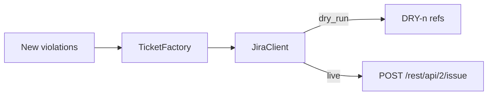

# jira

Ticket creation for new findings.

| Module | Role |
|--------|------|
| `ticket_factory.py` | Groups violations → Jira field payloads |
| `client.py` | REST create with dry-run + selective retry |

Credentials: env vars named in `jira.api_token_env` / `jira.user_email_env` (never YAML).
