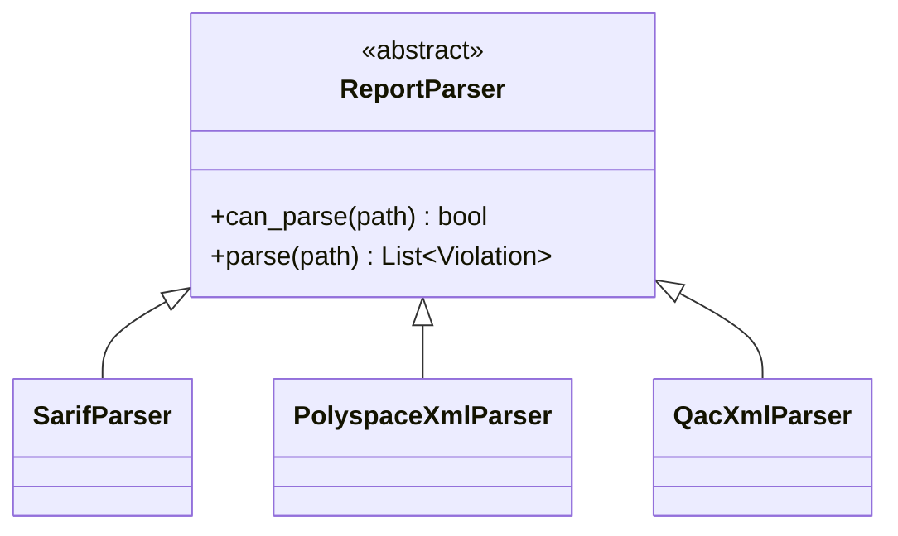

# parsers

Strategy-pattern adapters from tool exports → `list[Violation]`.

| Module | Role |
|--------|------|
| `base.py` | `ReportParser`, `detect_parser()`, I/O helpers |
| `sarif.py` | SARIF 2.1 (`runs` / `results`) |
| `polyspace_xml.py` | Bug Finder XML (`Check` / `Result`) |
| `qac_xml.py` | Helix QAC / PRQA XML |
| `rule_catalog.py` | MISRA category + ASIL heuristics |

To add a format: subclass `ReportParser`, then append to the candidate list in `detect_parser()`.
